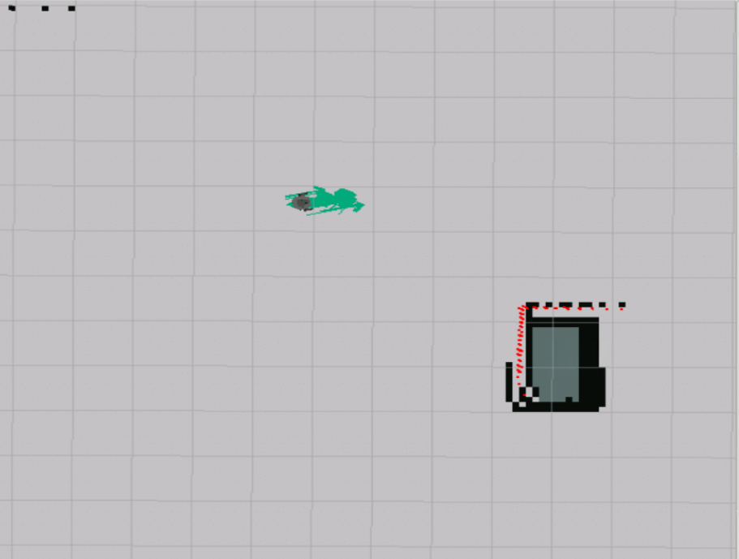

<center>
    <h1>Robotics Project</h1>
    <strong><h2>Technical Documentation</h2></strong>
    <br />
    <h3>Adem SAGLAM - Syed Muhammad Hashaam SAEED</h3>
    <br />
    <h2>Under Supervision of</h2>
    <h3><strong>Ralph SEULIN, Raphael DUVERNE and Daniel BRAUN</strong></h3>


### VIBOT M2 - 2020
</center>

---

## Introduction

Our robotics project is built on top of **ROS** short for Robot Operating System. An open source framework which provides many libraries and tools to simplify complex robotic behaviour. Ros even though the name contains operating system, it is a meta operating system made to create a thin layer between hardware and software while achieving;

- Platform independence (Easily integratable with other frameworks)
- Ros-Agnostic Libraries (Libraries less bound to ROS)
- Language independence (Roscpp, Rospy...)
- Testing
- Scaling

### Concepts of ROS

ROS seperates its concepts into three levels Filesystem level, Computation Graph level and Community level. From these three levels several resources from **Filesystem level** and **Computation Graph level** are very important for our project. First let us summarize the resources;

#### **File System Level**

This level contains files on storage device.

Packages, metapackages, package manifests, repositories, message types and service types.

#### **Computation Graph Level**

On this level the resources are computational.

Master, nodes, topics, messages, services, parameter server and bags.

#### **Community Level**

This level contains community additions to the project most important one is the documentation.

## Technical Analysis

Within the availability of concepts; we used several of them extensively. Here is the resources we used with explanations;

#### **Master**
is the bridge of the computational level it register [nodes](#node) and [services](#service), exchanges [messages](#message) between different nodes by tracking subscribers and publishers. Generally run with the command `roscore`

#### **Node**
is a process unit generally built to occupe with one concern like navigation. Nodes register to master and using the [topics](#topic) and [services](#service) they communicate between other nodes. Nodes have a unique name and they form a graph when combined.

<center>
  <figure>
    
    <figcaption>A graph showing the nodes and their subscriptions.</figcaption>
  </figure>
</center>

We create nodes using a client-library like **rospy**, **roscpp**.

#### **Topic**
can be considered like a pipeline strictly connecting two endpoints, here endpoints are nodes. All the topic's are bound to a **message type** from [File System Level](#file-system-level).

<center>
  <figure>
    
    <figcaption>A graph showing how topics connect nodes</figcaption>
  </figure>
</center>

In topic's case one node has to **publish** to a topic with a topic name and a message type in order for another node to be able to **subscribe** to it.

#### **Message**

Communication between nodes are done by transmitting messages through topics or services. Messages can be primitive or structural and their type should be defined in [File System Level](#file-system-level), in order for to be bound by topics and services. Also since File System Level resources is storage based we can find their description files in our system.

<a href="http://wiki.ros.org/rosmsg" target="_blank">`rosmsg`</a> is a great tool for learning the structure of a message.

#### **Service**

Services are a way of communication between nodes like topics difference comes from communication strategy. With publish/subscribe system requests to nodes are done with publishing to related topic; response to that request can only be observed through the side effects.

<center>
  <figure>
    
    <figcaption>A figure illustrating the request and side effect relation</figcaption>
  </figure>
</center>

In this basic example if we want to know if the robot reached our target position; we need to track changes in side effects. Of course nodes generally publish to extra topics directly related to requests but this doesn't change the one-way behaviour between request and response.

For this reason there is **services** in ROS which can establish a two way behaviour to our requests.

<center>
  <figure>
    
    <figcaption>A figure illustrating the request and response system on services</figcaption>
  </figure>
</center>

It should also be noted that this workflow is syncronous so it blocks the client node until a response is recieved.


## Implementation

In this chapter we will explain what we used for each principle resource that we listed and explained in the previous chapter to achieve our tasks. After we are going to describe main application flow.

As for environment; we are implementing our project using construct sim a web platform which embeds a code editor, gazebo simulation, graphical user interface (for accessing any extra graphic application) powered by a pre-configured ROS distribution behind. For each of its unit there are different packages installed and different configurations applied. For the unit that we are realising our project. It gives us a pre-installed ROS Kinetic distribution along with Turtlebot3 packages.

For observing the map and changes we are using Rviz a visualization tool for ROS.

**Initially** it start `roscore` and `gazebo` for us so when we look at the `rostopic list` output we observe that essential topics are there.

```bash
/clock
/cmd_vel
/gazebo/link_states
/gazebo/model_states
/gazebo/parameter_descriptions
/gazebo/parameter_updates
/gazebo/set_link_state
/gazebo/set_model_state
/imu
/joint_states
/odom
/rosout
/rosout_agg
/scan
/tf
/tf_static
```

A cafeteria map is loaded through Gazebo yet to be discovered by us.


### Task 1

Task is: **Create a script that moves the robot around with simple /cmd_vel publishing. See the range of
movement of this new robot model.**

**cmd_vel** topic is an essential topic for publishing velocity commands; it accepts `Twist` messages which can be found under `geometry_msgs.msg` namespace.

For this task we didn't launch any extra files since initial launch already subscribes to `/cmd_vel` topic. We tried publishing directly from our node and observing by echoing from command line.

```py
msg = Twist()
msg.linear.x = 0.1
```

Message to publish only contains a linear movement on x direction.

From `rostopic echo /cmd_vel` we observed following.

```bash
linear:
  x: 0.1
  y: 0.0
  z: 0.0
angular:
  x: 0.0
  y: 0.0
  z: 0.0
```

With this methods our abilities to control the robot is very limited.

### Task 2

Task is: **Create the mapping launches, and map the whole environment. You have to finish with a clean map of
the full cafeteria. Setup the launch to be able to localize the Turtlebot3 robot.**

We set us a base by creating a launch file named `start_mapping.launch` in our project's launch folder. It contains the configuration we took from **"Mastering Turtlebot3 Unit3"**

This launch file starts the node **turtlebot3_slam_gmapping** provided within Turtlebot3 packages also sets some configuration for this node to work properly also loads the robot model using urdf models.

Gmapping package is an implementation of a SLAM method which builds an **OccupancyGrid** from **Odometry Data** and **LaserScan**. Also gmapping node publishes to many topics for simulation and made them available for our usage, to be able to observe them we added necessary **displays** to **Rviz** and saved that config within our project folder with the name **project_def.rviz**

#### **Mapping**

Map is the backbone of navigation stack, it topic contains  crucial data for localization, pathfinding. It publishes <a href="http://docs.ros.org/en/melodic/api/nav_msgs/html/msg/OccupancyGrid.html">nav_msgs/OccupancyGrid</a> type of messages.

OccupancyGrid data contains probabilities. Quote from ROS wiki for data of OccupancyGrid
> The map data, in row-major order, starting with (0,0).  Occupancy probabilities are in the range [0,100].  Unknown is -1.

When we start the simulation first time our **OccupancyGrid** data will be filled with Unknowns(-1) because we didn't yet feed enough data from **LaserScan**. As laserscan has its maximum range (contained in the `maxUrange` in launch file) we will only have the probabilities within range.


<center>
  <figure>
    
    <figcaption>Sometimes a picture worths a thousand words</figcaption>
  </figure>
</center>

We can observe the laser distance readings by red in the picture. So in order to fill probabilities of the map all that is rest to do is move our robot until we cover the whole area.

To do that we can use a simple application provided by Turtlebot3 package called teleop which permits us to move the robot using keyboard buttons.

`roslaunch turtlebot3_teleop turtlebot3_teleop_key.launch`

<a href="https://streamable.com/35ibhb">View the video</a>

<center>
  <figure>
    
    <figcaption>Once finished we endup with a clean map</figcaption>
  </figure>
</center>

We have the map with correct probabilities in our map topic but if we don't save it we will have to reset from start again.

For that reason Ros has a tool called map saver, it saves the map to storage device to use it later. We save the map with following command

`rosrun map_server map_saver -f name_of_map`

Our map is saved under **maps/my_cafe**

#### **Localizing**

Second goal of the Task 2 is to localize the robot in the map. This wasn't a problem when we first recorded the map but when we launch our robot with the same configuration and a saved map, we have limited abilities to localize our robot's physical position related to the map. Or if we put the robot to **exact** same position where we first started to record the map everything would be alright since that isn't possible we need a localization system.

Our first tool is estimating the pose using Rviz, based on our visualizations we can set an estimated physical pose of the robot however less precise.

Our second tool is provided thanks to ROS which is called **AMCL** (Adaptive Monte Carlo Localization) it is using sensor data to estimate the pose of the robot. It creates arrows for the probable pose of the robot while doing that. This probable poses gets more precise when the robot moves. We can observe these behaviour by subscribing to the `/particlecloud` topic which will be published by amcl node.

<center>
  <figure>
    
    <figcaption>Before we move the robot, we see that there is less precision on the pose of robot</figcaption>
  </figure>
</center>

<center>
  <figure>
    
    <figcaption>After we move the robot, pose probabilities are much precise</figcaption>
  </figure>
</center>

We created another launch file to utilise the map we saved in the previous section and also setup the amcl. This file can be found in the project directory **launch/start_localization.launch** It also contains configuration parameters of **amcl** node to work.

<a href="https://streamable.com/cy3s6f">Video Link</a>

### Task 3

Task is: **Set up the move base system so that you can publish a goal to move_base and Turtlebot3 can reach
that goal without colliding with obstacles.**

Moving the robot by setting a goal pose is provided by a node called **move_base** which is a part of navigation stack.

<center>
  <figure>
    
    <figcaption>After we move the robot, pose probabilities are much precise</figcaption>
  </figure>
</center>

It also reacts to obstacles which was present statically in the map or obstacles that pops up (could be a customer in the cafe) by recalculating the path to goal again.

We configured our launch file to use **move_base** node using the configurations provided in Unit 3 of Mastering Turtlebot3 course in construct sim. We needed to change re-inclusion of a node by removing some fields.

Our last launch file that combines everything in the project can be found under **launch/move_base.launch**. And parameters related to pathfinding algorithm can be found under **param** folder.

After setting up **move_base** node we needed to send goals from our client node. There are two ways, one is publishing a <a href="http://docs.ros.org/en/melodic/api/geometry_msgs/html/msg/PoseStamped.html">PoseStamped</a> message to **move_base_simple/goal** topic or using the [service](#service) exposed by the node **move_base_msgs/MoveBaseActionGoal**.

We chose to use service because of the suitability of services for the task to come.

<a href="https://streamable.com/sfunq0">Video Link</a>

## Task 4

Task is: **Create a program that allows the Turtlebot3 to navigate within the environment following a set of
waypoints. Waypoints location are presented on the next page.**

We chose to implement this task using following steps:

- We collect waypoints from Rviz's Publish Point tool
- We highlight each point using Rviz text markers by the order
- We send move base goals using a loop and a syncronous service call

### Collecting the waypoints

We chose to use Publish Point tool on Rviz to collect waypoints, this button published a **geometry_msgs.msg/Point** to `/clicked_point` topic but this method has a drawback because we need to send a goal pose but with this tool we will have a point. In order to find the least complex way we recorded the starting pose of the robot and kept it for the waypoint move goals.

### Highlighting the waypoints

For each waypoint created we also create a <a href="http://wiki.ros.org/rviz/DisplayTypes/Marker">Text type of marker</a>
this markers are published to **visualization_marker_array** topic and handled by the Rviz Display **MarkerArray**.

<center>
  <figure>
    
    <figcaption>Waypoints are numbered in the order they created</figcaption>
  </figure>
</center>

### Moving between waypoints

Goals are created using some parameters from the initial **amcl_pose** topic like **frame_id**, and **orientation** and the point is given by the saved points.

We did blocking service calls in a loop until all waypoints are reached.

## Application Flow

Application has an entry file called `main.py` this script is responsible from listening the keyboard input from user and calling the required function in a thread. Enter button stops the active threads.

All the functionality related methods are in `App` class. It is instantiated once in `main.py` and the rest of the thread are created from its methods so this way we keep the information from different modes of the application.

<a href="https://streamable.com/24ecqc">Final Video</a>


## Launching the project

Our project has an entry script file which a user can give commands to achieve the tasks and a customized launch file that sets up the required nodes and configuration parameters in place for the script to work properly. Since some functionality of the application required us to select points from the map we also use Rviz.

**First we launch the base**

Using a terminal;

`roslaunch ros_project_2020 move_base.launch`

**Second we launch the application**

From another terminal

`rosrun ros_project_2020 main.py`

**Launching the Rviz for observing**

In order to observe the robot

`rosrun rviz rviz -d ~/catkin_ws/src/ros_project_2020/turtlebot3_slam.rviz`


## References

- http://wiki.ros.org/ROS/Introduction
- http://wiki.ros.org/ROS/Concepts
- http://wiki.ros.org/rospy
- http://wiki.ros.org/roscpp
- https://roboticsbackend.com/what-is-a-ros-service/
- https://emanual.robotis.com/docs/en/platform/turtlebot3
- https://emanual.robotis.com/docs/en/platform/turtlebot3/slam/
- https://www.theconstructsim.com/robotigniteacademy_learnros/ros-courses-library/mastering-with-ros-turtlebot3/
- Mastering ROS for Robotics Programming book
- http://docs.ros.org/en/melodic/api/nav_msgs/html/msg/OccupancyGrid.html
- http://docs.ros.org/en/melodic/api/geometry_msgs/html/msg/PoseStamped.html
- http://wiki.ros.org/rviz/DisplayTypes/Marker
- http://wiki.ros.org/simulator_gazebo/Tutorials/SpawningObjectInSimulation