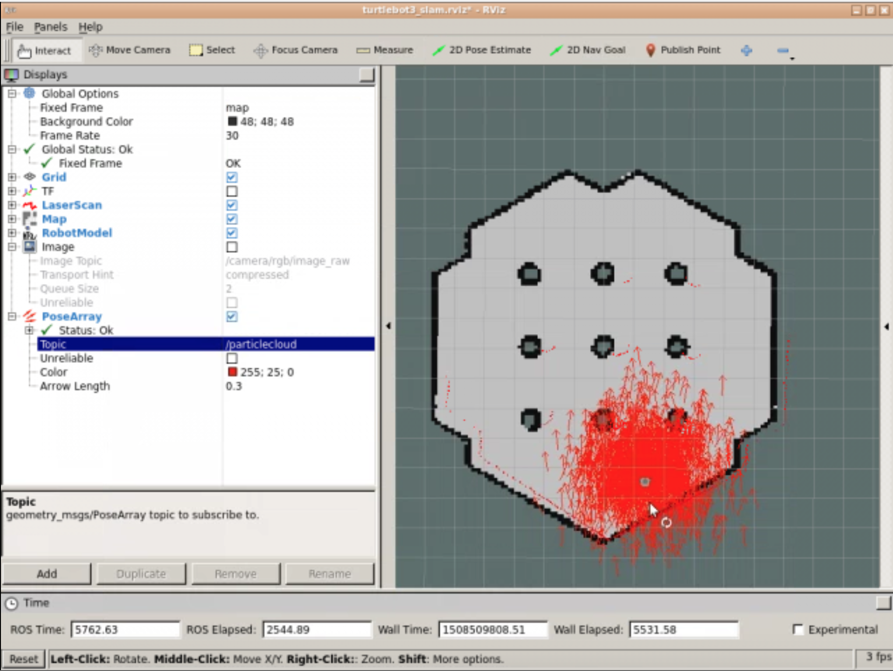

# Ros basics

## Topics

### Get a list of active ros topics

`rostopic list`

### Get info about a topic

`rostopic info /cmd_vel`

### Messages

More information about the contents of the messages

`rosmsg show geometry_msgs/Twist`

Find standard messages

`roscd std_msgs/msg/`

### Publishing to a topic

```
rostopic pub /cmd_vel geometry_msgs/Twist "linear:
    x: 0.0
    y: 0.0
    z: 0.0
angular:
    x: 0.0
    y: 0.0
    z: 0.0
"
```
you can use tab auto completion

### Reading the topic data

`rostopic echo /scan -n1`


## Teleop with keyboard

`roslaunch turtlebot3_teleop turtlebot3_teleop_key.launch`


### Rviz

`rosrun rviz rviz`

In the global options **Fixed Frame** should be set to `base_scan` after adding **LaserScan** to visualize the laser scan readings.

**To show the amcl particles**

Add **PoseArray** to rviz.



## Ros Packages

### Creating a package

`catkin_create_pkg <package_name> <dependencies>`

`catkin_create_pkg exercise_1_4 rospy`

### To build packages

In workspace folder for example: ___~/catkin_ws___

`catkin_make`

Sourcing and refreshing them for the Ros system to locate

`source devel/setup.bash`

`rospack profile`

# rospy

### Minimal rospy script

```py
#! /usr/bin/env python

import rospy

rospy.init_node("adm")
rate = rospy.Rate(2)

while not rospy.is_shutdown():
    print("tick")
    rate.sleep()
```

```py
import rospy
from std_msgs.msg import Int32 

rospy.init_node('topic_publisher')
pub = rospy.Publisher('/counter', Int32, queue_size=1)
rate = rospy.Rate(2)

while not rospy.is_shutdown():     
  rate.sleep()
```

### Publishing to a topic

```python
from std_msgs.msg import Int32 

pub = rospy.Publisher('/counter', Int32, queue_size=1)
count = Int32()
count.data = 1
...'in loop'
pub.publish(count)
```

### Launch file

Launch file for running a script from the package

```xml
<launch>
    <!-- My Package launch file -->
    <node pkg="my_package" type="simple.py" name="adm"  output="screen">
    </node>
</launch>
```

## Mapping

### Saving the map

```bash
rosrun map_server map_saver -f name_of_map
```