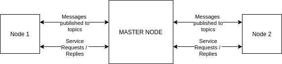
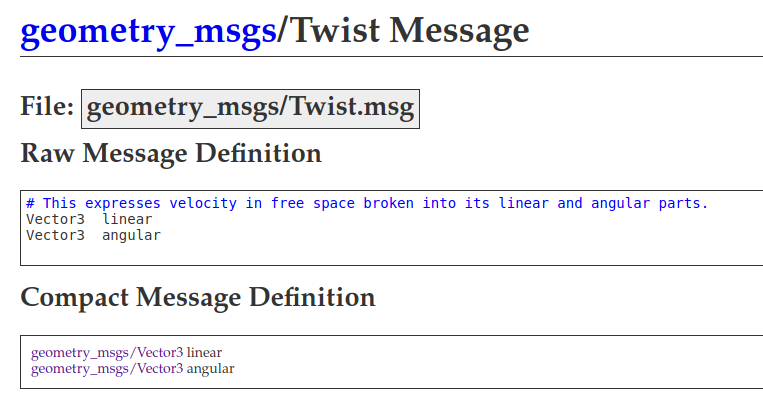
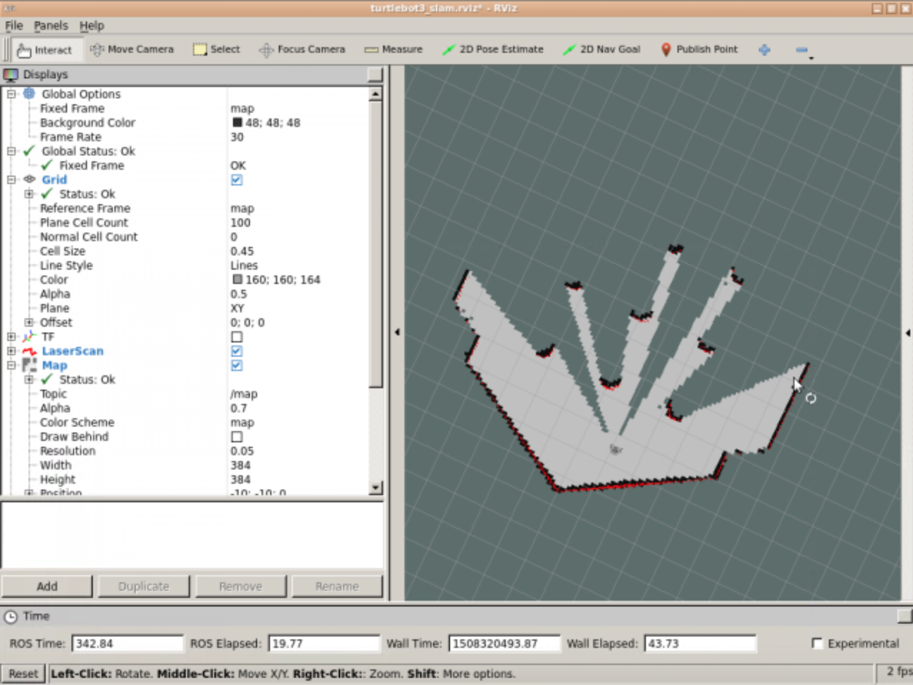
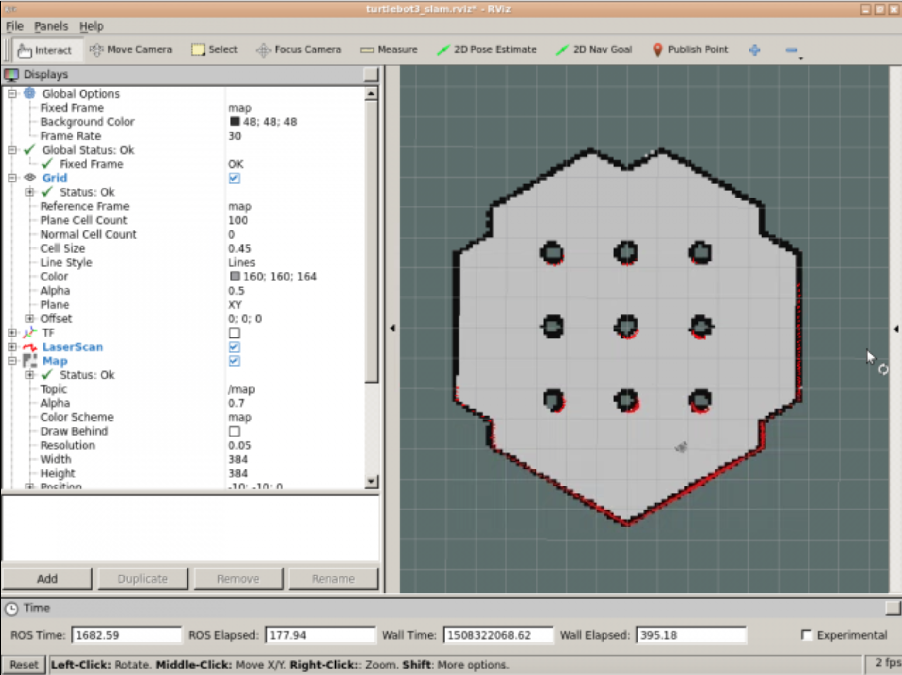
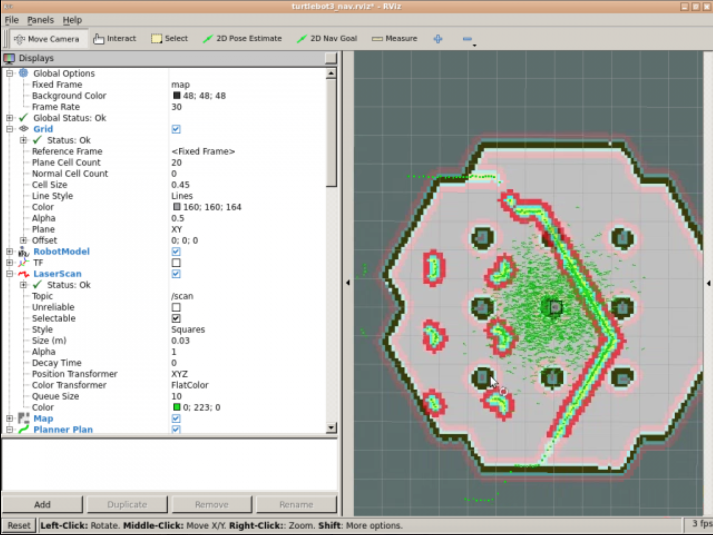

<center>
    <h1>Robotics Project</h1>
    <strong><h2>Technical Survey</h2></strong>
    <br />
    <h3>Adem SAGLAM - Syed Muhammad Hashaam SAEED</h3>
    <br />
    <h2>Under Supervision of</h2> 
    <h3><strong>Ralph SEULIN</strong></h3>


### VIBOT M2 - 2020
</center>

---

### Sections

- Introduction
- Techniques
- Implementation Details
- References

<center><h1>Introduction</h1></center>


For our robotics project we are expected to use ROS _a suite of linked software designed to interface and simplify robotics hardware_ on a robot platform called Turtlebot 3 to accomplish the following tasks; **to move the robot using simple velocity commands, map an environment, setup coordinate based move command and finally using the setup move the robot to through given waypoints while avoiding obstacles**

<center><h1>Techniques</h1></center>

Ros framework contains many functionalities to simplify common tasks and it offers developers to extend and develop with the same manner. Basic unit of functionality in Ros is a **package** which contains executable processes called **nodes**. Nodes can communicate using **messages** _[a pub/sub system](https://en.wikipedia.org/wiki/Publish%E2%80%93subscribe_pattern)_ and **services** _a synchronous request/reply system_, all communication is done through using a special node called **Master Node**

<center>


</center>

<center><h1>Implementation Details</h1></center>

Before moving to each task we created our project's outlines. Our project is going to be a single package containing scripts for each task.

## Task 1

This task is moving the robot with simple velocity messages to topic `cmd_vel`

Message that is going to be published will be of `geometry_msgs/Twist` type.



Task can be achieved using a suitable launch of ROS system. For example various Turtlebot 3 launchers.

- We need to check the existence of topic's availability using `rostopic list`
- If the `cmd_vel` is available in the core we can launch our script to publish our `Twist` messages.

## Task 2

This task is mapping an environment, in this case environment will be Costa Coffee in Barcelona. What is especially important in this task is a launch of ROS system with laser or point cloud readings which measures the distance of the robot and the objects. Using this readings and combining them with the position of the robot we obtain our environment.

Thanks to turtlebot packages we can use `turtlebot3_slam_gmapping` with the configuration on **theconstructsim** prepared for simulations.

#### Mapping

After launching our launch file we launch `rviz` to observe laser readings which is going to be saved into our map file.

We launch the rviz with the following command ```rosrun rviz rviz -d `rospack find turtlebot3_slam`/rviz/turtlebot3_slam.rviz```



<center>Initial map</center>

Now we need to move the robot the get it close to objects and edges to map the full environment.

In order to do that we can use teleoperation launcher with the following command

`roslaunch turtlebot_teleop keyboard_teleop.launch`

After moving the robot we should get the full map as in the example illustration



#### Saving the map

The map we observe in **rviz** is not in a persistent stage, we can create a map file for later use by following command.

`rosrun map_server map_saver -f name_of_map`

This will save two files:

One is a file with the `pgm` extension containing [OccupancyGrid](http://docs.ros.org/en/melodic/api/nav_msgs/html/msg/OccupancyGrid.html)
Other file with `yaml` extension contains meta information essentiel for the `OccupancyGrid`

#### Loading the map and localizing the robot

For this subtask we need `map_server` package with correct map argument, `amcl` package with simulation friendly arguments so that it works. We use the given configuration in the platform.

Localization requires the map and laserscan data so in each usage we need to use a launch according to that.

## Task 3

We are going to use `move_base` package for this task which handles path planning and obstacle detection. Since we still need `amcl` and `map_server` packages, we built a new launch file following the guide in platform. 

With `move_base` package we issue a target pose for the robot and it calculates the path while **actively** avoiding obstacles.

Before we start giving move base commands we need to match the pose of the robot in simulation to physical pose of the robot (which in this case will be gazebo). Otherwise initial result would be like following.



We will align the position using `rviz` `2D pose estimate` tool.

Once aligned we can issue `move_base` commands with `rospy` or for testing `rviz` `2D Nav Goal` command.

## Task 4

This task requires us to give `move_base` commands in an order to follow a waypoint. There are many options to do this we prefer to do it using hard-coding the pose's to our script file.

To get the poses we use `Publish Point` button in rviz which publishes a point to topic `/clicked_point`

After we get our waypoint poses we are going to use `SimpleActionClient('move_base', MoveBaseAction)` in a loop waiting each command to finish.

# References

- https://en.wikipedia.org/wiki/Publish%E2%80%93subscribe_pattern
- http://wiki.ros.org/ROS/Concepts
- theconstructsim.com